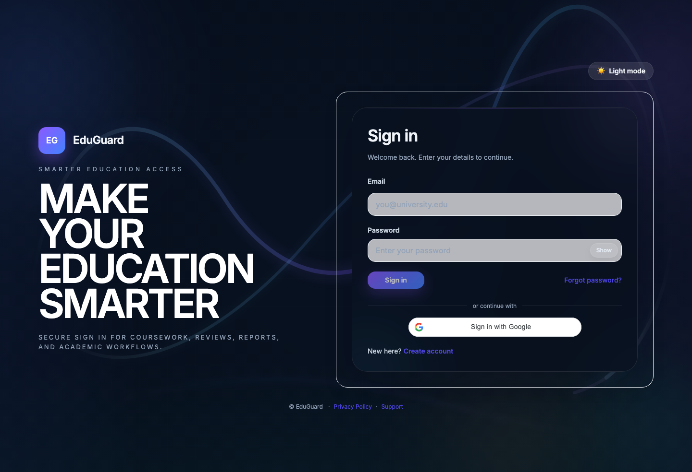
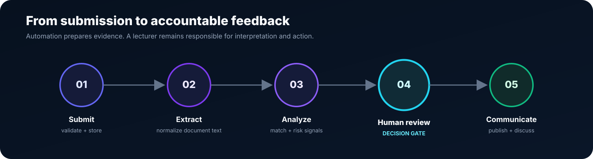
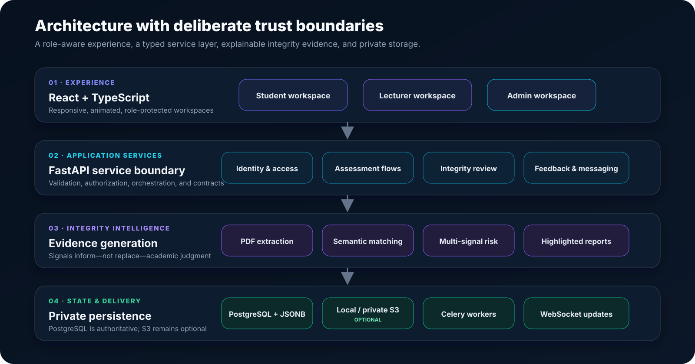

<p align="center">
  
</p>

<p align="center">
  <a href="https://github.com/Himath2002/eduguard-integrity-platform/actions/workflows/quality.yml"></a>
  <a href="https://github.com/Himath2002/eduguard-integrity-platform/actions/workflows/codeql.yml"></a>
  
  
  
</p>

<p align="center">
  <strong>A full-stack workspace for submission integrity, evidence review, assessment feedback, and role-aware academic operations.</strong>
</p>

EduGuard brings students, lecturers, and administrators into one controlled workflow. It combines PDF validation, semantic source matching, multi-signal AI-risk analysis, human review, marking, reporting, and contextual communication—without treating an automated score as an academic decision.

> [!IMPORTANT]
> Integrity results are decision-support evidence. EduGuard keeps the lecturer in control of interpretation, false-positive correction, feedback, and publication.

## Product experience

<p align="center">
  
</p>

The interface is responsive, animated, and organized around three protected workspaces:

<table>
  <tr>
    <td align="center" width="33%">
      <br />
      <strong>Student workspace</strong><br />
      <sub>Submit work, follow analysis, explore released evidence, and respond to feedback.</sub>
    </td>
    <td align="center" width="33%">
      <br />
      <strong>Lecturer workspace</strong><br />
      <sub>Review evidence, correct false detections, mark submissions, and publish feedback.</sub>
    </td>
    <td align="center" width="33%">
      <br />
      <strong>Administrator workspace</strong><br />
      <sub>Govern access, classes, institutional reporting, announcements, and platform settings.</sub>
    </td>
  </tr>
</table>

| Workspace | Core capabilities |
| --- | --- |
| **Student** | Join classes, view work, submit PDFs, follow processing status, inspect released integrity evidence, receive marked reports, and discuss feedback. |
| **Lecturer** | Manage classes and work, review submissions, inspect source matches and AI-risk spans, correct false detections, annotate PDFs, publish feedback, and communicate in context. |
| **Administrator** | Govern users and classes, view institution-level reporting, inspect integrity evidence, manage announcements, and configure platform settings. |

## Integrity workflow

<p align="center">
  
</p>

1. **Controlled submission** — validates extension, MIME type, file signature, size, enrollment, attempt rules, and assignment state.
2. **Document preparation** — extracts and normalizes PDF text into comparable evidence units.
3. **Evidence analysis** — combines semantic source matching with configurable multi-signal AI-risk analysis.
4. **Human review** — exposes phrases, sources, confidence signals, and false-positive correction with review locking and version history.
5. **Accountable feedback** — produces highlighted reports, marking annotations, publication controls, announcements, and contextual discussion.

## Architecture

<p align="center">
  
</p>

EduGuard deliberately separates presentation, orchestration, analysis, and state:

- The **React + TypeScript** client uses protected routing, role layouts, typed feature modules, React Query, Redux Toolkit, and route-level code splitting.
- The **FastAPI** boundary owns request validation, authorization rules, persistence orchestration, storage handoffs, and API contracts.
- The **integrity domain** handles PDF extraction, normalization, chunking, semantic comparison, AI-risk signals, and report generation.
- **PostgreSQL** is the source of truth. Local filesystem storage is supported for development; private S3 storage and Celery workers are optional deployment edges.
- **WebSocket events** keep role dashboards and communication surfaces current without making the client authoritative.

## Engineering highlights

- **Evidence before verdicts** — detailed sources, highlighted text, component signals, and confidence context remain inspectable.
- **False-positive governance** — lecturer overrides are locked, idempotent, persisted, and versioned.
- **Private document handling** — generated upload paths are excluded from Git; S3 objects are private and accessed through short-lived signed operations.
- **Memory-bound browser identity** — account metadata stays in application state instead of persistent web storage, reducing exposure on shared devices.
- **Resilient submission rules** — failed analysis does not consume a valid attempt, while attempt identifiers remain collision-safe.
- **Focused delivery** — route-level lazy loading reduced the production entry bundle from a monolithic payload to independently loaded feature chunks.
- **Layered verification** — backend, component, browser, API-collection, and performance suites cover the system at different boundaries.

## Technology stack

| Layer | Technologies |
| --- | --- |
| Web client | React 19, TypeScript, Vite, Tailwind CSS, Framer Motion |
| Client state and validation | Redux Toolkit, TanStack Query, React Hook Form, Zod |
| API | FastAPI, Pydantic, SQLAlchemy |
| Integrity analysis | PyMuPDF, Sentence Transformers, PyTorch, NumPy, spaCy, FAISS on Linux |
| Persistence | PostgreSQL, JSONB |
| Background and realtime | Celery, WebSockets; RabbitMQ/Redis-compatible endpoints |
| Object storage | Local private files or optional Amazon S3 through `boto3` |
| Quality | Pytest, Vitest, Testing Library, Playwright, Postman/Newman, k6, CodeQL |

## Repository map

```text
eduguard-integrity-platform/
├── backend/
│   ├── app/
│   │   ├── ai/                   # extraction, models, risk signals, reference corpus
│   │   ├── api/                  # auth, role, integrity, and communication routes
│   │   ├── domains/integrity/    # matching, extractors, and report generation
│   │   ├── models/               # SQLAlchemy domain entities
│   │   ├── services/             # orchestration, storage, marking, and realtime
│   │   ├── workers/              # optional Celery analysis tasks
│   │   └── tests/                # backend unit, integration, and security tests
│   └── requirements.txt
├── frontend/
│   ├── src/
│   │   ├── app/                  # routing and store configuration
│   │   ├── features/             # admin, auth, lecturer, and student modules
│   │   └── shared/               # UI, hooks, themes, API, and report tooling
│   ├── tests/e2e/                # seven Playwright workflow suites
│   └── package-lock.json
├── docs/                         # visuals and test traceability
├── postman/                      # executable API regression collections
└── tests/
    ├── performance/              # k6 workload suites
    └── test-data/                # synthetic positive and negative fixtures
```

## Run locally

### Prerequisites

- Python **3.12**
- Node.js **22.12+** and npm
- PostgreSQL **16**
- Optional: RabbitMQ/Redis for Celery and an S3-compatible private bucket for direct object-storage uploads

### 1. Configure PostgreSQL and the API

Create an empty PostgreSQL database and application user, then configure the backend:

```bash
git clone https://github.com/Himath2002/eduguard-integrity-platform.git
cd eduguard-integrity-platform

cp backend/.env.example backend/.env
cd backend
python -m venv .venv
source .venv/bin/activate
python -m pip install --upgrade pip
python -m pip install -r requirements.txt
uvicorn app.main:app --reload --port 8000
```

At minimum, replace `DATABASE_URL` and `GOOGLE_SIGNUP_SECRET` in `backend/.env`. If Google sign-in is required, configure the same OAuth client identifier in both environment files. The interactive API documentation is available at:

- Swagger UI: `http://127.0.0.1:8000/docs`
- ReDoc: `http://127.0.0.1:8000/redoc`
- Health check: `http://127.0.0.1:8000/health`

### 2. Start the web client

In a second terminal:

```bash
cd eduguard-integrity-platform/frontend
cp .env.example .env
npm ci
npm run dev
```

Open `http://127.0.0.1:5173`.

### Optional deployment services

EduGuard runs its core API and local multipart upload routes without AWS. To re-enable private S3 upload flows, provide `AWS_ACCESS_KEY_ID`, `AWS_SECRET_ACCESS_KEY`, `AWS_REGION`, and `S3_BUCKET_NAME` in `backend/.env`; do not commit those values. The existing storage adapter uses private objects, validated upload metadata, and signed requests.

To run asynchronous integrity jobs through Celery, configure `CELERY_BROKER_URL` and `CELERY_RESULT_BACKEND`, then start a worker from `backend/`:

```bash
celery -A app.workers.celery_app.celery_app worker --loglevel=INFO
```

## Verification

The repository includes **375 automated checks** across the PostgreSQL backend, frontend component layer, and browser workflows, plus API and performance collections.

### Frontend quality gate

```bash
cd frontend
npm ci
npm run check
```

This runs ESLint, 98 Vitest/Testing Library checks, TypeScript compilation, and the optimized Vite production build.

### PostgreSQL backend suite

With `DATABASE_URL` pointing to a disposable PostgreSQL database:

```bash
cd backend
source .venv/bin/activate
python -m pytest -q
```

The suite contains 246 tests across access control, document management, integrity analysis, false-detection review, reporting, feedback, and realtime communication.

### Browser workflows

```bash
cd frontend
npx playwright install chromium
npm run e2e
```

The seven Playwright suites define 31 end-to-end browser scenarios for protected access, submissions, review, reporting, and communication.

### API and performance surfaces

- `postman/` contains focused Newman-compatible regression collections.
- `tests/performance/` contains k6 workloads with health gates, realistic setup, and latency thresholds.
- `docs/test-strategy-and-traceability/` maps product rules to executable evidence.

Performance scripts expect a running, disposable environment. Review their environment variables before execution; never point load tests at production data without authorization.

## Security and data boundaries

- Never commit `.env` files, OAuth secrets, cloud credentials, database exports, or runtime uploads.
- Keep authenticated identity in application memory; route handoff state carries short-lived sign-in challenges without persistent browser storage.
- Use synthetic documents for tests and demonstrations.
- Keep object-storage buckets private and grant the application only the permissions it needs.
- Treat AI-risk and similarity outputs as probabilistic evidence, not proof of misconduct.
- Follow [SECURITY.md](SECURITY.md) for private vulnerability reporting.

## Project stewardship

Maintained by [Himath Ahangama](https://github.com/Himath2002). Contributions should preserve privacy, reviewability, and the human decision boundary; see [CONTRIBUTING.md](CONTRIBUTING.md).

No open-source license is currently granted. The source is available for portfolio review; contact the maintainer before reuse or redistribution.
